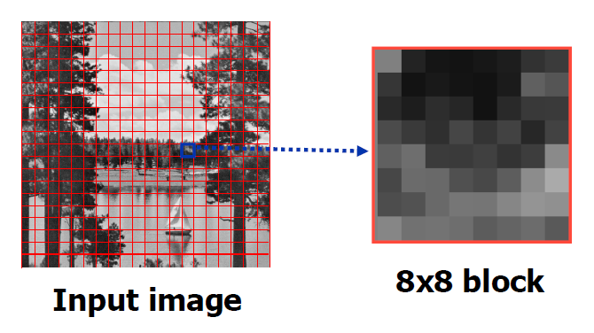
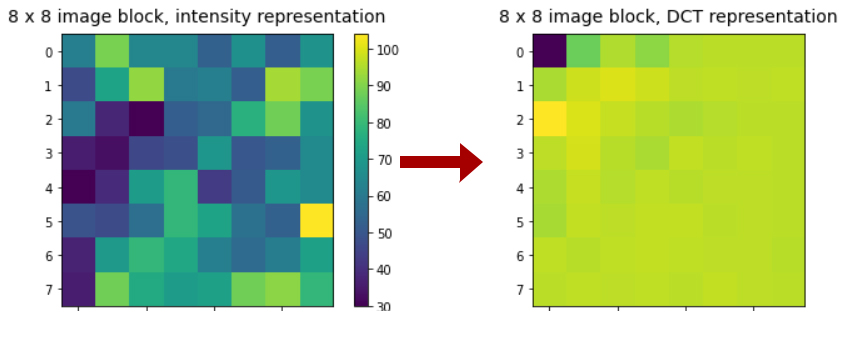
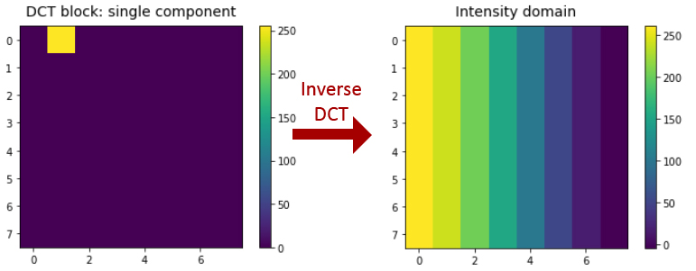
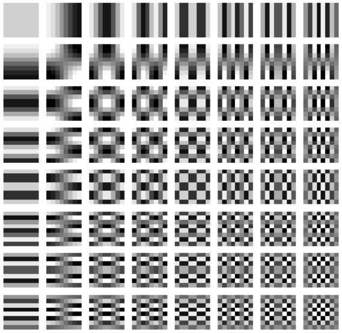
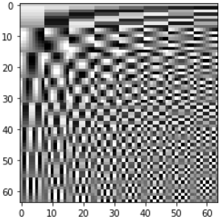
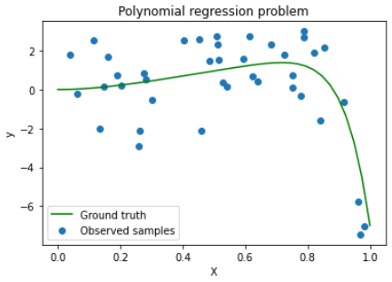
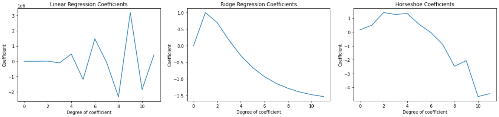
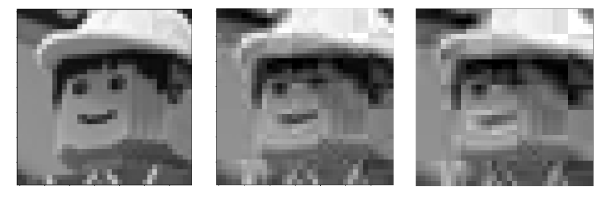
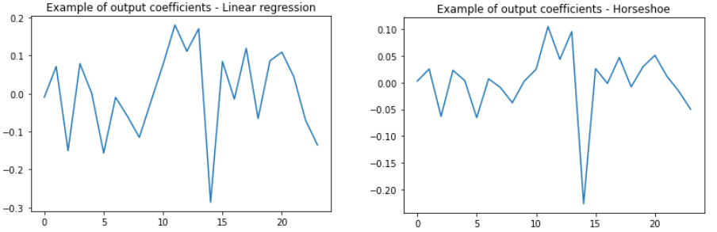
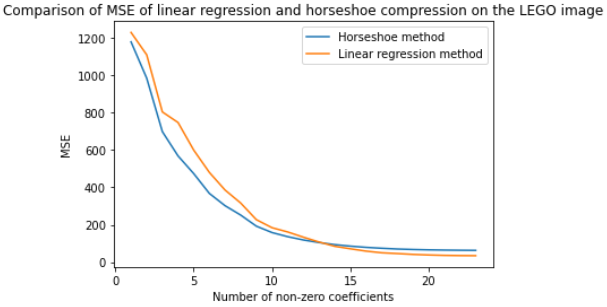

# Horseshoe prior applied to image compression

__Maxime Bouton, Elliot Mouchon__

 

We recommend reading this presentation first. Otherwise, you can go through the `ipynb` files in the following order:  
- `Polynomial_Regression_Example.ipynb`
- `Image_comp.ipynb`
- `Evaluation_horseshoe_comp.ipynb`

There might be trouble rendering equations in this `README.md` file. If it is the case, you can check the `README.ipynb` file.
___
## Introduction

  The following implementation aims at using the Horseshoe prior in an image compression context. The goal is of course not to try to compete with existing highly optimized compression algorithms, but rather to find a real-word application to the Horseshoe prior method. We figured that using it in such a context would help offering a visual and intuitive representation of this bayesian method in order to complete the formal and rather theoretical view from the paper. We decided to come up with a method of our own while trying to be creative.
  
 
 

___ 
## I. JPEG compression

  Some ideas of our method are inspired from JPEG compression. Therefore, let us recall the key steps of this compression standard, which remains one of the most widely used ones. For simplicity, we exclusively focus on compressing the luminance channel (greyscale images).
  
### 1. Slicing an image in 8 x 8 blocks.

  

<h4 align="center">Fig.1 - Jpeg Slicing operation</h4>

 
 
    
### 2. Converting each block to DCT representation.  

  
 

<h4 align="center">Fig.2 - From intensity domain to frequency domain using DCT</h4> 

 
 

The DCT provides a frequency representation of the image. Component [0, 0] represent the continuous component of the image (its mean). Components on the right and bottom represent higher and higher frequencies in their respective directions. Component [7,7] represent the highest considered frequency in the 2 directions.

### 3. Selecting most relevant components.

Then, in order to compress the image, one will select the most relevant frequencies. This is achieved by dividing the DCT matrix component-by component-by a given "Quantization matrix" (these are standard matrices described by the JPEG norm). Then, by rounding the floating point results to convert them into 1-byte integer values, many 0 appear, generally mostly among the highest frequencies. The result can then be encoded using a lossless compression algorithm, like the Huffman encoding for instance.

  
 
 

___
## II. Image compression as a sparse regression problem.

Instead of selecting features in the frequency DCT domain, let us simplify things by selectings the exact same features but this time in the intensity domain. A DCT 8 x 8 block can be described as a linear combination of its indididual components. By computing the inverse DCT transform of these individual components, we are able to compute a basis of 64 8 x 8 blocks in the intensity domain. Here is an example on a given single DCT component (Fig.3).  

<h4 align="center">Fig.3 - Building an intensity basis: example on a given DCT component.</h4> 

 
 

This way we are able to compute a full intensity basis, see Fig.4.  

<h4 align="center">Fig.4 - The intensity basis  in the case of 8 x 8 blocks.</h4> 

 
 

This way, any block of an image can be expressed as a linear combination of these newly defined blocks. In order to express to compression problem formally in this new setting, let us first flatten each of these basis blocks and store them in a new 64 x 64 matrix. In this new matrix , each row represents one of these flattened blocks (see Fig.5).

<h4 align="center">Fig.5 - The intensity basis matrix of flattened blocks, .</h4>

 
 

Now, let  be a flattened block. There exist a vector  of coefficients such that:  

The matrix  being invertible, there is an obvious exact solution to this problem. However, in many cases, fully describing a DCT block from a real-world image requires most of the elements from the intensity basis . In a compression context like Jpeg, the goal would be to find a solution  with few non-zero components while keeping  as close as possible from . In other words, the goal is to find a  solution for . This is where the Horseshoe prior come into play.

 
 

___
## III. The Horseshoe prior applied to a polynomial regression

Now that we took inspiration from the Jpeg method to formalize image compression as a regression problem, let us vizualize how the Horseshoe method behaves in a similar well-known context: polynomial regression.  

Formally:  

 - , let , a polynomial of maximum degree , with  real coefficients .  
 - , let us define  and , with  fixed.

One of such problems is illustrated in Fig.6.

<h4 align="center">Fig.6 - A typical polynomial regression problem.</h4>

Given 

Let us define:  

Then, the polynomial regression problem writes as a simple linear regression problem:  

We generated and solved such problems in files `Polynomial_Regression_Example.ipynb` and `Horseshoe_poly_reg.py` using linear regression, Ridge regression and the Horseshoe Prior. Check this file for detailed explainations. The main takeaways of our observations can be summarized as follows (see Fig.7):

<h4 align="center">Fig.7 - Output coefficient  when solving the problem of Fig.6, with these 3 methods.</h4>

- The linear regression is actually able to find relatively sparse solutions in the sense that there is a noticeable discrepency in the entries of . Some of its entries are near zero whereas others are very large in comparison. It also achieves the best training accuracy. However, it overfits without regularization. This overfitting is mainly due to the very large coefficient values associated with higher polynomial degrees, which triggers a high dependency on the training set and therefore a high variance.  

- The ridge regression coefficient  is better in the sense that it is able to offer a solution which is more general, since its polynomial coefficients do not explode. However, it does not manage to create a strong discrepency between the entries. Most polynomial degrees have a similar importance in this solution.  

- Strictly speaking, the Horseshoe regression coefficient  is not sparse either. Indeed, none of its entries are  zero. This makes sense regarding the construction of the Horseshoe method, as opposed to discrete mixture models. However, since the paper describes it as a way to handle sparsity, we expected to observe many entries  zero. It is not really the case here. On second thought, this solution remains better from a sparsity viewpoint. Indeed, it provides a general solution with a stronger discrepency between its entries than Ridge, while avoiding the exploding high degree coefficients of the linear model. As a consequence, at the scale of , one can consider the entries in [-1, 1] to be near 0 since they do not stand out in comparison with the components around [-5, -4]. It would be harder to make the same conclusion with , which entries are more concentrated in [-1, 1.5]. It is a matter of scale !

Note that the distributions used in our implementation of the Horseshoe were the ones recommended in the paper. Specifically: 
- 
- , a Cauchy distribution.
-  too.  

The Cauchy distribution being heavy tailed, favors very low values of  while slowly diminishing its tolerance to higher values as they increase. This is what enables this method to provide a tradeoff ensuring that entries of  may get big only if it is required. Therefore, they tend to be bigger than ridge's ones, but do not explode.  
Overall, our observations coincide with the theory.

 
 

___
## The Horseshoe Prior applied to image compression  

We introduced the problematic of image compression and we observed the behavior of the horseshoe prior applied to polynomial regression. Let us move to image compression. The code is available in files `Image_comp.ipynb` and `Horseshoe_img_comp.py`.We decided to proceed in the following manner:

- First slice the image in 5 x 5 blocks, in a jpeg fashion. Empirically, this block size seemed to be a good tradeoff as MCMC computations get slower with increasing block sizes. Having a small block size also puts more weight on the prior, since as a regression problem the block size can be considered as the number of observations. Therefore, it ensures sparse results. The block size is denoted by .  

- Then, the mean component is dealt with appart. Indeed, the mean component being often higher than others in real-world images, we noticed that keeping it often yielded results that were "too sparse" (the output coefficients were mostly zero except for the mean component). For a single block:  
    - Let  be a flattened block
    - 
    - Then, let us remove the first line of the intensity basis matrix  (which corresponds to the mean component). This gives .
    - Find a pseudo-sparse vector  of size  which approximately solves: . This is achieved via the Horseshoe.  
    - Put less significant values of  to 0 to build . For instance, keep the 5 most significant ones.
    - Finally:   

 

- Putting the blocks together forms the compressed image. One only needs to store the non-zero components of the  of every block instead of its 5 x 5 values. As in a usual Jpeg process, one could then entropy-encode these coefficients.

 

<h4 align="center">Fig.8 - Image compressed using the Horseshoe. The original image is drawn from the UCID dataset, in TIFF format. From left to right: original image, compression with 6 remaining components, compression with 4 remaining components (out of 25 components).</h4>

 
 

Fig. 8 illustrates the results of a compression using this method. It was applied to a low resolution image because the process is time consuming. The compression process works, but is there any interest in the use of the Horseshoe prior method compared to a simple linear regression followed by a selection of the most interesting features ? Looking at Fig.9 there do not seem to be much difference on first sight. The peaks are similar and it seems that one could select the most interesting coefficients straight in the linear solution. Indeed, this would also lead to a lossy compression, but the Horseshoe method remains superior. Indeed, by considering pseudo-sparse solution, the Horseshoe method tend to compensate the shrinkage of smaller coefficients by adjusting the value of other coefficients. This is why most significant coefficient in the Horseshoe solution do not have the exact same value as the one of the linear solution.

<h4 align="center">Fig.9 - Comparing output coefficients of a linear regression and the Horseshoe method for the same single block.</h4>

 
 

The superiority of the Horseshoe solution is illustrated in Fig. 10. See the file `Evaluation_horseshoe_comp.ipynb` for details. It shows that when a small proportion of coefficients are chosen to be non-zero (i.e. when compressing more), the Horseshoe solution gives a smaller MSE compared to the linear solution. This tendency is inverted as the number of non-zero components is increased, which makes sense: The full linear solution is an exact solution to the problem, whereas the Horseshoe solution is an approximate pseudo-sparse solution.

 

<h4 align="center">Fig.10 - Comparing the accuracy of both linear and horseshoe compressions depending on the number of non-zero coefficients over the full LEGO picture of figure 8.</h4>

Our observations coincide with the theory again, but of course one would need further analyses to confirm the general behavior of the method, which would be time consuming given its slowness.

 
 

## References:  

- Figure 1. - [projectrhea.org](https://www.projectrhea.org/rhea/index.php/Homework3ECE438JPEG) 
- Subject paper - [Handling Sparsity Via the Horseshoe](https://www.projectrhea.org/rhea/index.php/Homework3ECE438JPEG), Carlos M. Carvalho, Nicholas G. Polson, James G. Scott.
- The Jpeg standard -  [The Jpeg still picture compression standard](https://ieeexplore.ieee.org/document/125072), G.K. Wallace.